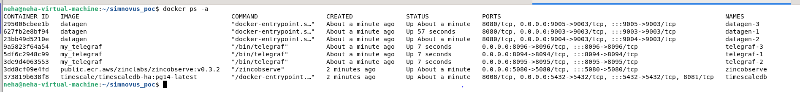
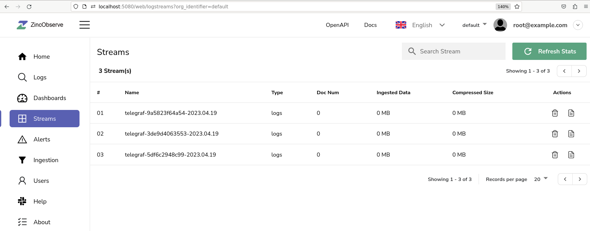

# Multiple Test case execution

This poc integrates telegraf with [datagen](https://github.com/Simnovus-Corp/simnovator-2.0-poc/multiple_test_execution/datagen), [zincObserve](https://github.com/zinclabs/zincobserve) and [timescaledb](https://github.com/timescale/docs.timescale.com-content/blob/master/tutorials/telegraf-output-plugin.md). Telegraf configures websocket as input plugin to listen data from datagen on websocket and zincObserve, timescaldb as output plugin to store stats and log data.

In this poc,  multiple datagen containers with multiple telegraf containers are running along with timescaledb and zincobserve. Telegraf further stores data of stats, ue_get from ueserver.js and pingdata from appmanager.js in timescaledb postgresql. Telegraf stores log_get data to ZincObserve for further log searching operations. Refer [multiple_test_execution](https://github.com/Simnovus-Corp/simnovator-2.0-poc/multiple_test_execution/doc/multiple_test_execution.png) diagram for more details.

# Setup

To setup multiple test execution, follow below steps.


## step-1: clone the repo
    https://github.com/Simnovus-Corp/simnovator-2.0-poc.git


## step-2: create datagen image
```bash
cd multiple_test_execution/datagen
docker build -t datagen .
```
     
## step-3: create docker cluster
```bash
cd simnovator-2.0-poc/multiple_test_execution/
docker-compose up -d
```

# Verification

## 1. Verify all containers are up and running



## 2. Open http://localhost:5080 in your browser that opens up zincobserve UI having log indexes for all three telegraf instances.



## 3. Check data stored in postgresql

```bash
$ docker exec -it timescaldb psql -U admin
$ \c admin -> selects admin database
$ \dt -> show all tables inside admin database
$ select * from table_name -> show all data from particular table
```

## 4. Verify data consistency using below steps:

### Step1: Get Count of data sent from datagen


```bash
$ docker logs datagen-1 | grep -i stats | wc -l  -> Get stats count from ueserver

$ docker logs datagen-1 | grep -i ue_get | wc -l  -> Get ue_get count from ueserver

$ docker logs datagen-1 | grep -i log_get | wc -l  -> Get log_get count from ueserver

$ docker logs datagen-1 | grep -i start_test | wc -l  -> Get pingdata count from appmanager
```

### Step2: Get count of data received at telegraf

```bash
$ docker logs telegraf-1 | grep -i cellslayer | wc -l  -> stats data count

$ docker logs telegraf-1 | grep -i uelayer | wc -l  -> ue_get data count

$ docker logs telegraf-1 | grep -i logdata | wc -l  -> log_get data count 

$ docker logs telegraf-1 | grep -i pingdata | wc -l  -> pingdata count
```

### Step3: Repeat step1 and step2 for datagen-2, telegraf-2 instances and datagen-3, telegraf-3 instances.


### Step4: Get count of records for following tables in postgresql timescaledb. 


This count should match to sum of all stats data received at telegraf-1, telegraf-2 and telegraf-3. Similarly for pingdata and ue_get data.


```bash
$ docker exec -it timescaledb psql -U admin

$ \c admin

$ \dt

$ select count(*) from cellslayer;

$ select count(*) from uelayer;

$ select count(*) from pingdata;
```

# Clean up
docker-compose down
